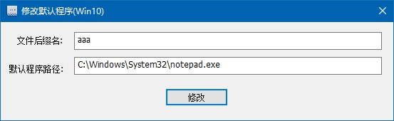

# ChangeDefaultProgramsInWin10

#### 项目介绍

    Change the default programs in Windows 10.
    修改win10默认程序（修改文件关联)

#### 工程

    使用vs2017编译 (microsoft visual studio 2017)

#### 使用

    1.进入dist目录，右键以管理员方式运行ChangeDefaultProgramsInWin10.exe

    2.例如要修改后缀名.aaa的文件关联notepad.exe文件。(以后双击.aaa文件，就使用notepad打开，则如下设置，点击修改即可)

	文件后缀名： file extensions
	默认程序路径： default program full path