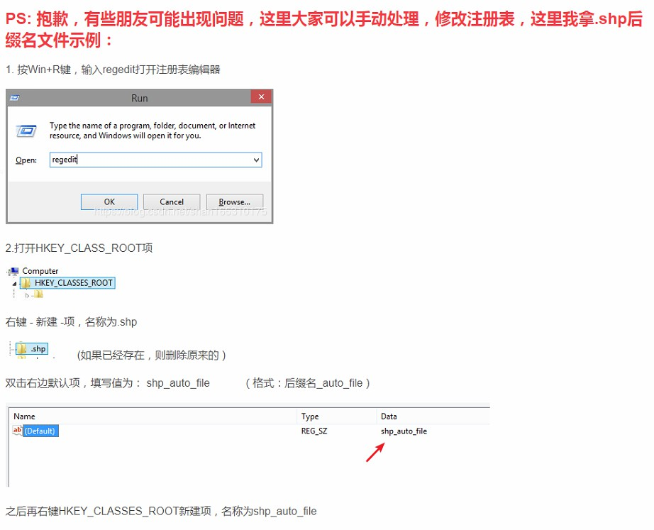
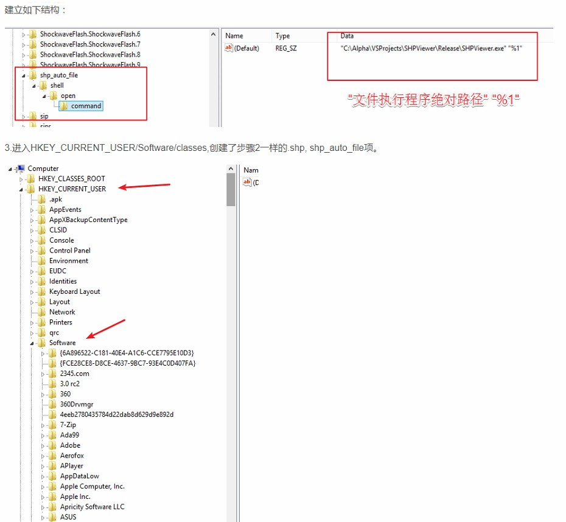
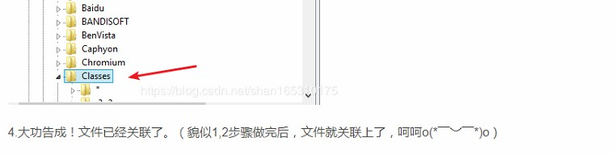

# ChangeDefaultProgramsInWin10

#### 项目介绍

    Change default programs in Windows 10.
    修改win10默认程序（修改文件关联)

    csdn: https://blog.csdn.net/shan165310175/article/details/83450187
    gitee地址：https://gitee.com/nothix/ChangeDefaultProgramsInWin10
    github地址：https://github.com/shan165310175/ChangeDefaultProgramsInWin10

#### 工程

    使用vs2017编译

#### 使用

    1.进入dist目录，右键以管理员方式运行ChangeDefaultProgramsInWin10.exe

    2.例如要修改后缀名.aaa的文件关联notepad.exe文件。(以后双击.aaa文件，就使用notepad打开，则如下设置，点击修改即可)

#### 如果运行失败，可以手动修改，很简单：

